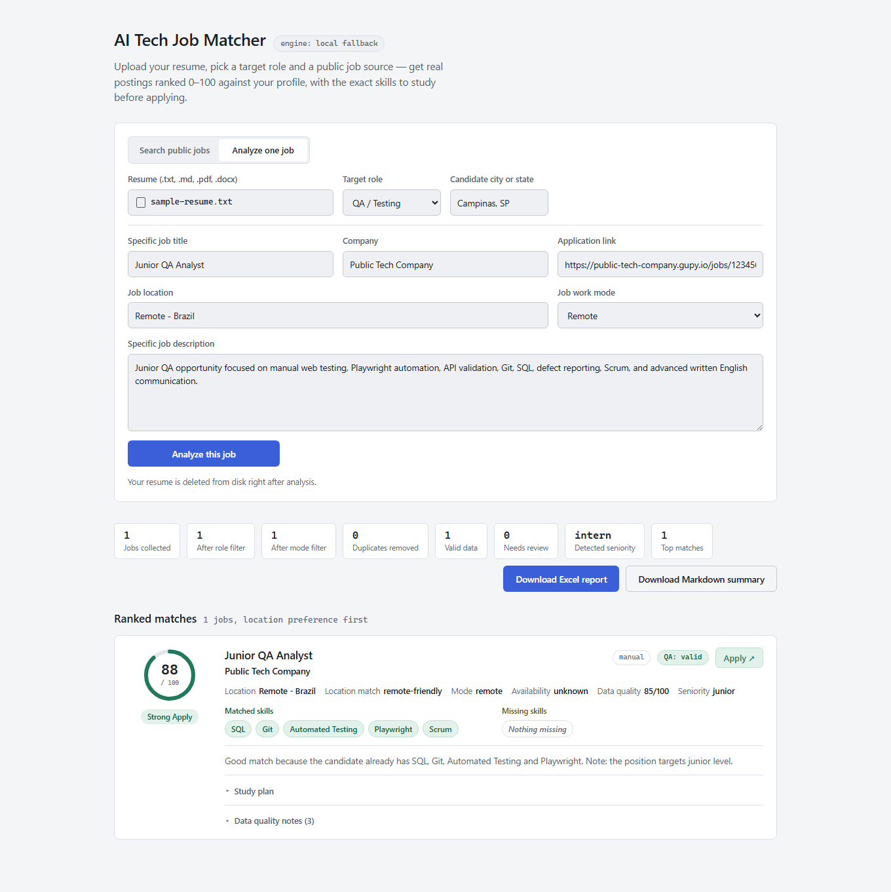

# AI Tech Job Matcher

TypeScript application that reads a resume, collects real public tech jobs, validates source data, ranks opportunities, and exports auditable Excel and Markdown reports.

[](https://github.com/JoaovSilva2005/ai-tech-job-matcher/actions/workflows/ci.yml)




Regenerate this screenshot with `npm run docs:screenshot`.

## QA Evidence

- 171 automated tests covering unit, API, integration, and browser E2E flows.
- Playwright exercises resume upload, specific-job analysis, downloads, mobile layout, and accessibility with Axe.
- Every job receives validation status, severity-ranked issues, and a 0-100 data quality score.
- Candidate-specific compatibility warnings are reported separately and never change source-data quality.
- Invalid, expired, or closed jobs are excluded with evidence in the Excel `QA Issues` sheet.
- GitHub Actions runs formatting, dependency audit, build, compiled-app smoke test, lint, and the full suite.
- A scheduled health workflow checks public sources and stores a JSON diagnostic artifact.

## Application Flow

1. Parse a `.txt`, `.md`, `.pdf`, or `.docx` resume.
2. Remove direct identifiers before any remote AI request.
3. Collect jobs from public APIs or explicitly configured public career pages.
4. Validate availability, dates, URLs, descriptions, work mode, and duplicates.
5. Analyze role, seniority, English, tools, and required skills.
6. Filter remote, hybrid, or on-site jobs and prioritize the candidate's city when provided.
7. Rank matches and generate Excel, Markdown, and JSON evidence.

The complete flow works without an API key through a deterministic local analyzer. Gemini, OpenAI, and Anthropic are optional adapters; failed or rate-limited calls fall back locally.

## Quick Start

Requirements: Node.js 22.3+ and npm.

```bash
npm install
npx playwright install chromium
npm run web
```

Open [http://127.0.0.1:4180](http://127.0.0.1:4180).

The web UI supports public-job search and analysis of one specific vacancy. Each web run has an isolated report directory, the uploaded resume is deleted immediately after processing, and report/API summaries expose only its format and extracted character count—not its filename or path.
The server listens on `127.0.0.1` by default. `HOST` and `PORT` can be set explicitly when a different bind address is required; exposing it outside the local machine requires appropriate access controls.

### CLI

Run a deterministic QA demo with no API key:

```bash
npm run demo:qa
```

Query all configured public sources:

```bash
npm run demo:all
```

Run with custom filters:

```bash
npx tsx src/index.ts --resume ./samples/sample-resume.txt --role qa --source gupy --work-mode hybrid --location "Campinas, SP" --limit 10 --fallback
```

Use `npx tsx src/index.ts --help` for every CLI option.

## Validation Commands

```bash
npm run format:check
npm run build
npm run test:dist
npm run lint
npm test
npm run sources:check
```

`sources:check` distinguishes healthy, empty, unconfigured, and failed sources and writes evidence to `output/source-health.json`.

## Public Job Sources

| Source          | Public integration            | Key required | Configuration                       |
| --------------- | ----------------------------- | -----------: | ----------------------------------- |
| Gupy            | Brazilian public career pages |           No | Optional `GUPY_CAREER_URLS`         |
| Jooble Brazil   | Brazilian REST search API     |          Yes | `JOOBLE_API_KEY`, `JOOBLE_LOCATION` |
| RemoteOK        | Public JSON feed              |           No | None                                |
| Remotive        | Public API                    |           No | None                                |
| The Muse        | Public API                    |           No | None                                |
| Jobicy          | Public remote-jobs API        |           No | Optional `JOBICY_GEO`               |
| Arbeitnow       | Public job-board API          |           No | None                                |
| Greenhouse      | Public Job Board API          |           No | Optional `GREENHOUSE_BOARD_TOKENS`  |
| Lever           | Public Postings API           |           No | `LEVER_COMPANY_SLUGS`               |
| Ashby           | Public Job Postings API       |           No | Optional `ASHBY_BOARD_NAMES`        |
| Recruitee       | Public Careers Site API       |           No | `RECRUITEE_COMPANY_SUBDOMAINS`      |
| SmartRecruiters | Public Posting API            |           No | Optional company IDs/key            |
| JSON-LD         | Authorized `JobPosting` pages |           No | `JSONLD_JOB_URLS`                   |
| All             | Bounded parallel aggregation  |           No | Uses every configured source        |

Nine sources work without keys using the default configuration. Collection is intentionally low-volume. The project does not bypass authentication or captchas and does not scrape LinkedIn, Indeed, Catho, InfoJobs, or Glassdoor. See [scraping ethics](docs/scraping-ethics.md).

## Reports

CLI reports are written to `output/`. Web reports use isolated, expiring run directories under `output/web/`.

```text
job-match-report.xlsx
execution-summary.md
jobs-raw.json
jobs-analyzed.json
resume-analysis.json
job-matches.json
```

The Excel workbook contains:

- `Ranking`: score, application hyperlink, source, availability, publication date, data quality, and candidate warnings.
- `Details`: parsed requirements, tools, gaps, explanation, study topics, and candidate warnings.
- `QA Issues`: field, severity, issue, status, quality score, and ranking inclusion.
- `Resume Analysis`: sanitized structured profile, never raw resume text.
- `Market Insights`: frequently requested skills by role.
- `Execution Summary`: resume format/size, filters, engine, counts, and runtime; never the resume filename or path.

## Configuration

No `.env` file is required. Copy `.env.example` only when configuring an optional provider or source:

```bash
cp .env.example .env
```

PowerShell:

```powershell
Copy-Item .env.example .env
```

Important options:

| Variable                       | Purpose                                        |
| ------------------------------ | ---------------------------------------------- |
| `AI_PROVIDER`                  | `fallback`, `gemini`, `openai`, or `anthropic` |
| `GEMINI_API_KEY`               | Optional Gemini key                            |
| `AI_REQUEST_TIMEOUT_MS`        | Remote AI request timeout                      |
| `AI_MAX_RETRIES`               | Retry count for transient AI failures          |
| `AI_JOB_CONCURRENCY`           | Maximum concurrent job analyses                |
| `HOST`                         | Web bind host; defaults to loopback            |
| `PORT`                         | Web port; defaults to `4180`                   |
| `GUPY_CAREER_URLS`             | Comma-separated public Gupy career pages       |
| `GREENHOUSE_BOARD_TOKENS`      | Comma-separated public Greenhouse board tokens |
| `LEVER_COMPANY_SLUGS`          | Comma-separated public Lever company slugs     |
| `ASHBY_BOARD_NAMES`            | Comma-separated public Ashby board names       |
| `RECRUITEE_COMPANY_SUBDOMAINS` | Public Recruitee careers-site subdomains       |
| `JOOBLE_API_KEY`               | Jooble REST API key                            |
| `JOOBLE_LOCATION`              | Default Jooble search location                 |
| `SMARTRECRUITERS_COMPANY_IDS`  | Public SmartRecruiters company identifiers     |
| `SMARTRECRUITERS_API_KEY`      | Optional SmartRecruiters `X-SmartToken`        |
| `JOBICY_GEO`                   | Optional Jobicy region slug                    |
| `JSONLD_JOB_URLS`              | Authorized JSON-LD job-detail pages            |

## Structure

```text
src/
  ai/        provider adapters, schemas, prompts, local fallback
  matcher/   role classification, skills, location, scoring, candidate warnings
  qa/        validation rules, deduplication, quality score
  reports/   Excel and Markdown generation
  resume/    parsing, limits, and personal-data sanitization
  scraper/   source registry, collectors, health checks
  web/       Express API and browser UI
tests/
  unit/      deterministic contracts and edge cases
  e2e/       pipeline, API, Excel, browser, accessibility
```

## Documentation

- [Architecture](docs/architecture.md)
- [QA strategy](docs/qa-strategy.md)
- [Test plan](docs/test-plan.md)
- [Test cases](docs/test-cases.md)
- [Bug report template](docs/bug-report-template.md)

## License

[MIT](LICENSE) - João Vitor da Silva
